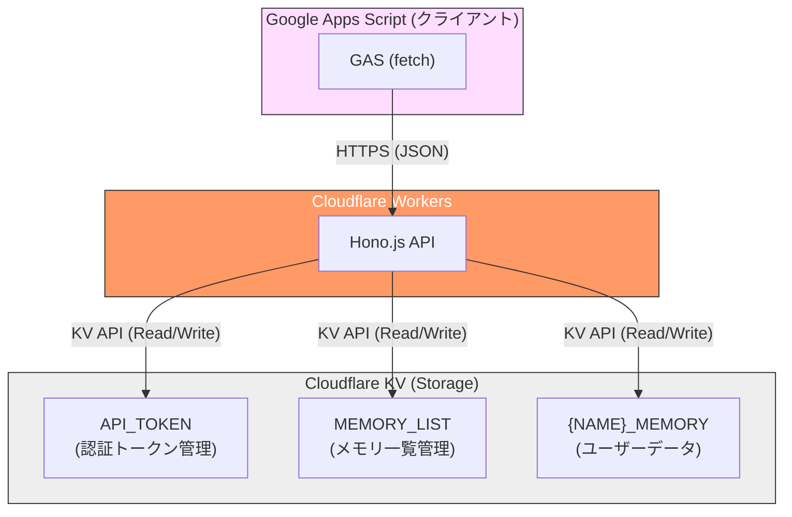
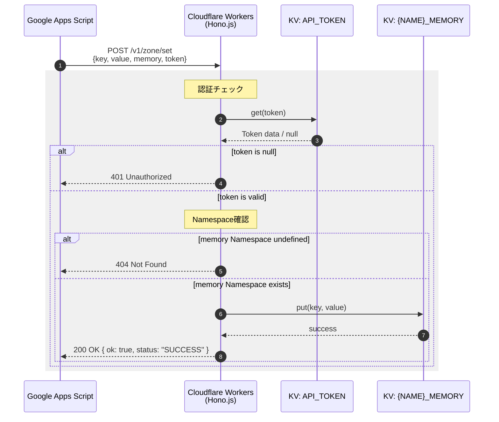

# アーキテクチャ

gas-kv-memoryのシステムアーキテクチャを説明します。

## システム概要



## コンポーネント

### Cloudflare Workers

- **ランタイム**: V8 JavaScript エンジン
- **フレームワーク**: Hono.js (TypeScript)
- **特徴**:
  - エッジロケーションで実行(低レイテンシ)
  - サーバーレス(自動スケーリング)
  - 無料枠: 100,000リクエスト/日

### Cloudflare KV

- **タイプ**: 結果整合性のあるKey-Valueストア
- **特徴**:
  - グローバルに分散
  - 読み取り最適化
  - 最大値サイズ: 25MB
  - 無料枠: 100,000読み取り/日、1,000書き込み/日

## KV Namespace設計

### API_TOKEN

認証トークンを管理するNamespace。

```
Key: "token-string-here"
Value: "active" (または任意のメタデータ)
```

トークンの存在確認のみで認証を行うため、値は任意です。

### MEMORY_LIST

利用可能なメモリNamespaceの一覧を管理(将来の拡張用)。

```
Key: "USERS"
Value: {"created": "2024-01-01T00:00:00Z", "description": "User data"}
```

### {NAME}_MEMORY

実際のユーザーデータを保存するNamespace。

```
Key: "user:123"
Value: "{\"name\":\"John\",\"age\":30}"
```

命名規則: `{MEMORY_NAME}_MEMORY`

## リクエストフロー



## ファイル構造

```
src/
├── index.ts      # メインアプリケーション
│                 # - Honoインスタンス作成
│                 # - ルーティング定義
│                 # - 各エンドポイントの実装
│
├── types.ts      # 型定義
│                 # - APIレスポンス型
│                 # - リクエストボディ型
│                 # - エラーコード
│                 # - 環境変数(Env)型
│
└── response.ts   # レスポンスヘルパー
                  # - success(): 成功レスポンス生成
                  # - noop(): NOOP レスポンス生成
                  # - error(): エラーレスポンス生成
```

## セキュリティ

### 認証

- トークンベース認証
- トークンはリクエストボディに含める(GASのUrlFetchAppの制限に対応)
- API_TOKEN KVでトークンの存在確認

### 通信

- HTTPS強制(Cloudflare Workersのデフォルト)
- CORS有効(GASからのクロスオリジンリクエストに対応)

### データ保護

- KVデータはCloudflareのインフラで暗号化
- トークンは平文で保存(ハッシュ化を推奨する場合は実装追加が必要)

## パフォーマンス

### レイテンシ

- Cloudflare Workers: 〜1ms(コールドスタート時も含む)
- KV読み取り: 〜10-50ms(エッジキャッシュヒット時は〜1ms)
- KV書き込み: 〜50-100ms(グローバル伝播に最大60秒)

### スケーラビリティ

- Workers: 自動スケーリング(制限なし)
- KV: 読み取り最適化、書き込みは秒間1000程度が実用的上限

## 制限事項

### Cloudflare Workers

| 項目 | 無料プラン | 有料プラン |
|------|-----------|-----------|
| リクエスト/日 | 100,000 | 無制限 |
| CPU時間/リクエスト | 10ms | 50ms |
| メモリ | 128MB | 128MB |

### Cloudflare KV

| 項目 | 無料プラン | 有料プラン |
|------|-----------|-----------|
| 読み取り/日 | 100,000 | 無制限 |
| 書き込み/日 | 1,000 | 無制限 |
| 削除/日 | 1,000 | 無制限 |
| リスト/日 | 1,000 | 無制限 |
| 値サイズ | 25MB | 25MB |
| キーサイズ | 512バイト | 512バイト |

## 拡張ポイント

### 計画中の機能

1. **TTL対応**: キーの有効期限設定
2. **名前空間管理API**: 動的なメモリ作成・削除
3. **アクセスログ**: リクエストログの記録
4. **レート制限**: トークンごとのリクエスト制限

### カスタマイズ例

```typescript
// TTL付きset
zone.post('/set', async (c) => {
  const body = await c.req.json<SetRequest & { ttl?: number }>();
  // ...
  await kv.put(body.key, body.value, {
    expirationTtl: body.ttl || undefined
  });
});
```
